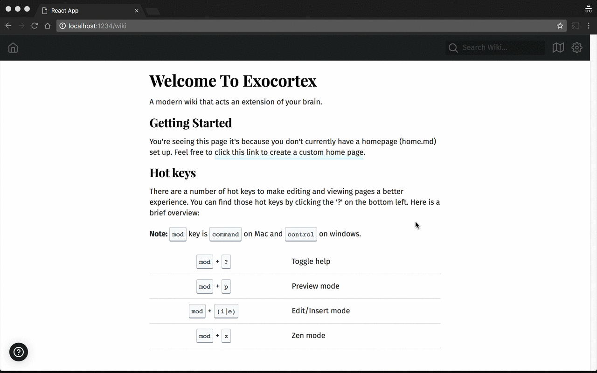

# Exocortex

A **modern** git based personal **wiki** that doesn't suck.

## Features

* **Language independent**
* **Easy/zero configuration**
* **Modern UI**
* **Git based versioning**
* **Git based syncing (to GitHub)**
* **Intuitive hotkeys for better editing UX**
* **Prefetch internal wiki pages for faster response times**
* [**Automatic Table Of Contents on pages (if you want)**](#auto-toc)
* **Spellcheck while you edit**
* **Live markdown preview**
* Many more...

## Why?

I couldn't find an open source wiki solution that I was happy with.  They either
looked super shitty, had terrible UX, or required a _ton_ of configuration to
get going (including sometimes installing new languages!).  Exocortex aims to
solve some these problems.

## First Principles

1. Should be easy to run locally - `brew install exocortex && exo new && exo start`
2. Should only require a git repo to operate - `git init`
3. Should have a modern interface that is a pleasure to work with (SPA React) - comes bundled with the binary.
4. Should be backed up in the cloud so I never lose my hard work - thank you GitHub!
5. Should only allow markdown for editing to reduce feature bloat - `.md` ftw :smiley:

## Installation

[Go binaries can be downloaded directly from the releases page.](https://github.com/SpencerCDixon/exocortex/releases)

### Homebrew

```sh
$ brew tap spencercdixon/formulae
$ brew install exocortex
$ exo new my-first-wiki
$ cd my-first-wiki && exo start
$ open http://localhost:1234
```

## User Requirements

1. Must have `git` installed
2. Wiki must **be a git repository**
3. Must have an `exocortex.json` in your repo.  (`exo init` for existing projects)
4. Nothing else :boom:

## Commands

* `new` - creates a new directory with an `exocortex.json` file
* `start` - boots up the wiki server
* `init` - creates a templated `exocortex.json` file based on sensible defaults
* `exo` - alias for start

## Configuration

You shouldn't really need to worry about this.  If you run `exo new` to create a
wiki or `exo init` in an existing directory full of .md files these will get
pre-populated with sensible defaults.

* `syncInterval` - time between remote pushes if remote is set up
* `repository` - absolute path to where the repo for this wiki lives
* `title` - base title for the wiki
* `remote` - where to push the wiki to on the interval
* `branch` - branch to use when pushing/pulling from remote
* `server.host` - host wiki is located at
* `server.port` - port to listen on

## Hotkeys



<table>
  <tr>
    <th>Action</th>
    <th>Shortcut</th>
    <th>Description</th>
  </tr>
  <tr>
    <td>Zen Mode</td>
    <td>
      <kbd>cmd</kbd> + <kbd>z </kbd>
    </td>
    <td>
      Eliminate all noise around the wiki for better editing
    </td>
  </tr>
  <tr>
    <td>Help Mode</td>
    <td>
      <kbd>cmd</kbd> + <kbd>/|? </kbd>
    </td>
    <td>
      Show hot key help
    </td>
  </tr>
  <tr>
    <td>Insert Mode</td>
    <td>
      <kbd>cmd</kbd> + <kbd>i </kbd>
    </td>
    <td>
      Turn whatever page you're viewing into 'edit' mode
    </td>
  </tr>
  <tr>
    <td>Save Page</td>
    <td>
      <kbd>cmd</kbd> + <kbd>s </kbd>
    </td>
    <td>
      Save the page you're working on
    </td>
  </tr>
  <tr>
    <td>Preview Mode</td>
    <td>
      <kbd>cmd</kbd> + <kbd>p </kbd>
    </td>
    <td>
      Turn whatever page you're viewing into 'edit' mode and split screen with a
      preview of what the MD will render to on the right
    </td>
  </tr>
</table>

### Auto TOC

**Tip**
> If you want your pages to have a Table of Contents just add a `# toc` somewhere in the markdown

## Feature Roadmap

Exocortex is missing a lot of useful features that would enable it to go beyond
just being a local personal wiki.  I developed it while on Thanksgiving vacation primarily 
on planes so there was a limited feature set that I decided to prioritize.  See below for a list of 
enhancements I'd like to add in the coming weeks:

- [ ] User authentication
- [ ] Prefetching of pages for better responsiveness
- [ ] Better UI customization/overrides
- [ ] Add ability to revert pages to previous commits
- [ ] Add ability to see diffs between commits

## Folder structure

```sh
home.md         <-- file used for wiki homepage (not required)
exocortex.json  <-- wiki globals (required)
.git            <-- data store for the wiki (required)
```

That's it!  The rest of your wiki can be structured however you'd like.

## API Routes

| Method | Path | Description |
|--------|------|-------------|
| **GET** | `/api/settings` | returns global wiki settings |
| **POST** | `/api/settings` | sets settings - only certain fields are allowed to be updated via API |
| **POST** | `/api/search` | search through wiki for a query |
| **POST** | `/api/images/:path-to-image` | serve static images found in the wiki |
| **GET** | `/api/wiki/:page-name` | retrieves content for this page |
| **POST** | `/api/wiki/:page-name` | writes the file, commits |
| **DELETE** | `/api/wiki/:page-name` | deletes the page |
| **GET** | `/api/` | returns list of prefixes available |
| **GET** | `/*` | return the UI |

## UI Routes
| Route | Description |
|-------|-------------|
| `/search`| Renders search results |
| `/wiki/:page-name` | Renders markdown of that path |
| `/wiki/new/:page-name` | Create a new page that doesn't exist in tree yet |
| `/wiki/edit/:page-name` | Update a page that exists |
| `/wiki/revisions/:page-name` | TODO: See past revisions |


## Why the name Exocortex?

Exocortex was shamelessly stolen from the book [Pragmatic Thinking &
Learning](https://pragprog.com/book/ahptl/pragmatic-thinking-and-learning).
Andy Hunt talks a lot about the value of having an 'excortex' or personal wiki
to record your learning.  I started documenting my own exocortex in `.md` files
a year or so ago and this project aims to be a nice interface for that work.

## Development/Contributing
**Note**: I'm open to bug fixes and feature requests but I'm not sure how much
free time I'll be able to commit to working on this.  If there is a feature you
_aboslutely must have right away_ then feel free to fork!

There are a whole bunch of TODO's I'm working through [located here](./todo.md).
If you want to help contribute those are a good place to start.

Ensure you have the following installed:

* `go 1.9`
* `node >6`
* `yarn`

**Quick Start Development**

Make bootstrap will build the UI, install the Go binary, create an empty example
wiki, and boot up that example wiki on `localhost:1234`.

```sh
$ go get -u github.com/spencercdixon/exocortex
$ cd $GOPATH/github.com/spencercdixon/exocortex
$ make bootstrap
```

**Frontend**

> First make sure you have the backend running on port 1234

To work on the frontend you can run:
```sh
$ cd ui
$ yarn install
$ yarn start
```

This should boot up `http://localhost:3000` with a dev server that proxies to
`localhost:1234` (where the API lives).

## Releasing

1. Create a new git tag:

```sh
$ git tag -a v0.1.0 -m "v1.0.0 major milestone!"
```

2. Export github token

```sh
$ export GITHUB_TOKEN=<repo access>
```

3. Use goreleaser to release.
```sh
$ make release
```
